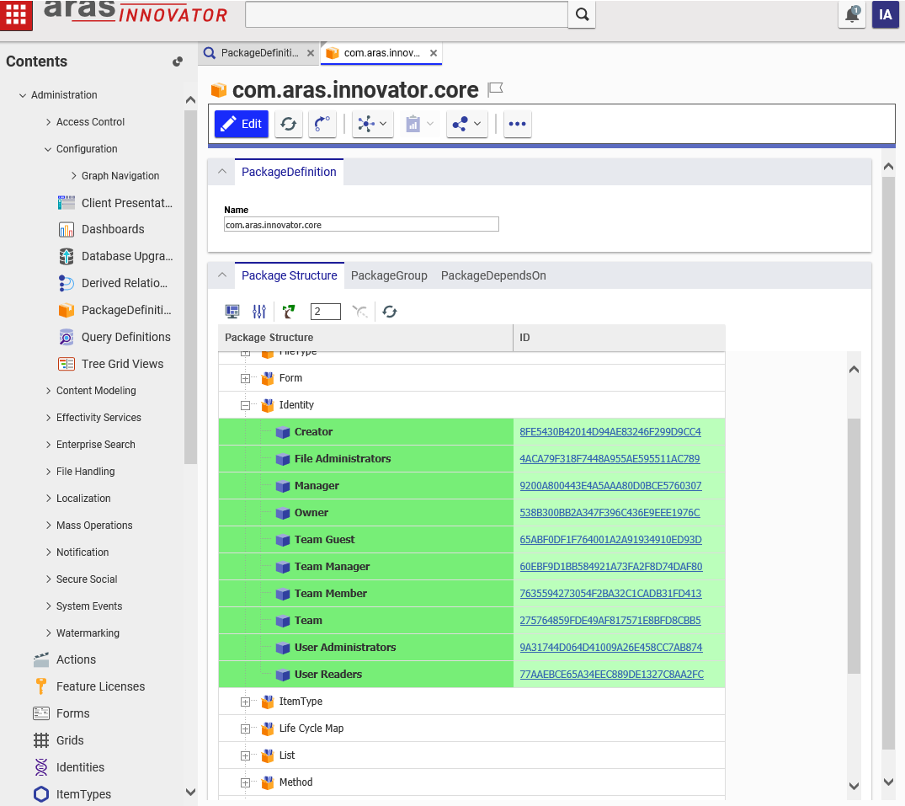

# Tree Grid View Sample

This project includes a very simple demonstration of Aras Tree Grid View (TGV) functionality. The import package adds a TGV to the PackageDefinition ItemType and displays the package structure in a relationship tab on every PackageDefinition item. The user can also open individual items that belong to the package - directly from the TGV.

An upcoming Aras Labs blog post will walk through the steps of manually configuring a TGV and the underlying QueryDefinition.  

## History

Release | Notes
--------|--------
[v1.0.0](https://github.com/ArasLabs/tree-grid-view-sample/releases/tag/v1.0.0) | First release.

#### Supported Aras Versions

Project | Aras
--------|------
[v1.0.0](https://github.com/ArasLabs/tree-grid-view-sample/releases/tag/v1.0.0) | 11.0 SP12, 11.0 SP11

> Warning: This package is not backwards-compatible with Innovator 11.0 SP10. 

## Installation:

#### Important!
**Always back up your code tree and database before applying an import package or code tree patch!**

### Pre-requisites:

1. Aras Innovator installed (version 11.0 SP12)
2. Aras Package Import Utility
3. aras.labs.TGV_Sample package

### Steps to install:

1. Backup your database and store the BAK file in a safe place.
2. Open up the Aras Package Import tool.
3. Enter your login credentials and click **Login**
    * _Note: You must login as root for the package import to succeed!_
4. Enter the package name in the TargetRelease field.
    * Optional: Enter a description in the Description field.
5. Enter the path to your local `..\tree-grid-view-sample\Import\imports.mf` file in the Manifest File field.
6. Select the following in the Available for Import field.
    * **aras.labs.TGV_Sample**
7. Select Type = **Merge** and Mode = **Thorough Mode**.
8. Click **Import** in the top left corner.
9. Close the Aras Package Import tool.

You are now ready to login to Aras and check out the PackageDefinition tree grid view.

## Usage

1. Login to Aras Innovator as admin.
2. Navigate to **Administration > Configuration > PackageDefinitions** in the TOC.
3. Open a PackageDefinition item. 

The "Package Structure" tab will display a tree grid view of the package contents. You can open individual items belonging to the package by clicking the id link in the grid. No need to go to the TOC and search for the items!

For questions on manually configuring a TGV or questions about how we configured or packaged this project, create a GitHub issue on this repo. 

## Contributing

1. Fork it!
2. Create your feature branch: `git checkout -b my-new-feature`
3. Commit your changes: `git commit -am 'Add some feature'`
4. Push to the branch: `git push origin my-new-feature`
5. Submit a pull request

For more information on contributing to this project, another Aras Labs project, or any Aras Community project, shoot us an email at araslabs@aras.com.

## Credits

Created by Eli Donahue for Aras Labs. @EliJDonahue

## License

Aras Labs projects are published to Github under the MIT license. See the [LICENSE file](./LICENSE.md) for license rights and limitations.
